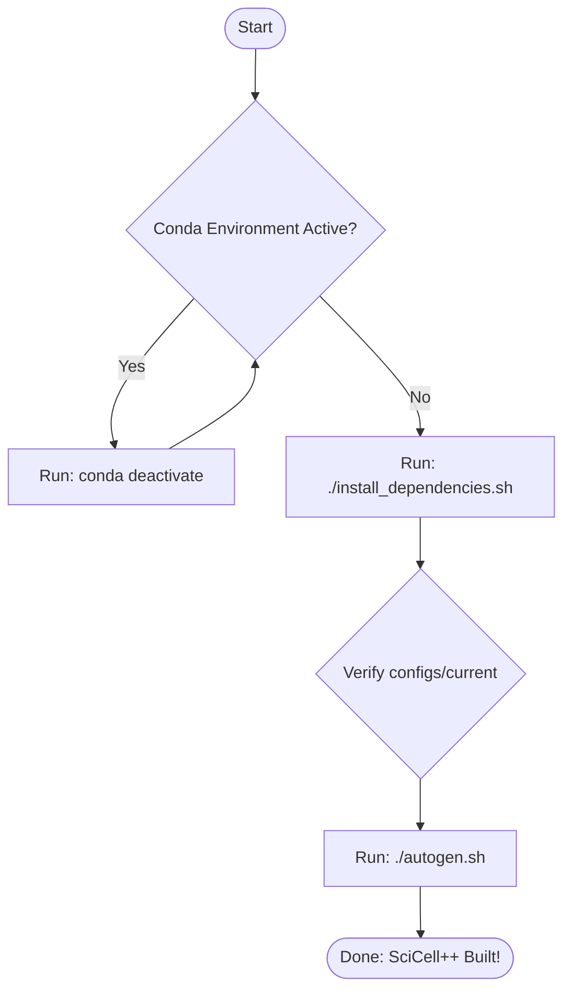

# SciCell++


[](https://codecov.io/gh/tachidok/scicellxx)
[](https://scicellxx.readthedocs.io)

---

SciCell++ is an object-oriented framework for the simulation of biological and physical phenomena modelled as continuous or discrete processes.

## Table of Contents

1. [Documentation](#documentation)
2. [Dependency Management and Installation](#installation)
3. [Featured demos](#featured_demos)
4. [How to contribute](#how_to_contribute)
5. [Facts and curiosities](#facts_and_curiosities)
6. [License](#license)

## Documentation <a name="documentation"></a>

The full documentation is
[here](https://scicellxx.readthedocs.io/en/latest/?badge=latest). You
will find installation instructions, demos, tutorials and workflows to
ease your journey with SciCell++.

## Dependency Management and Installation <a name="installation"></a>

SciCell++ utilizes **Spack** for managing external libraries (such as Armadillo, OpenBLAS, SuperLU, lcov, and VTK). Other dependencies like `argparse` and `numerical_recipes` are built directly from source inside the `external_src/` folder.

### Installation Workflow Diagram

The following diagram illustrates the proper sequence of steps to configure and build SciCell++. Note that any active Conda environment **must** be deactivated to prevent linking errors:



*ASCII Representation:*
```
  [ Start ]
      │
      ▼
  Is a Conda environment active?
   ├── YES ──► Run "conda deactivate" (repeat until none is active)
   └── NO
       │
       ▼
  Run "./install_dependencies.sh" (pulls & builds Spack packages)
       │
       ▼
  Verify configuration in "./configs/current" is ready
       │
       ▼
  Run "./autogen.sh" (builds SciCell++ and compiles internal/external sources)
       │
       ▼
  [ Done / Ready to Run ]
```

### Installation Steps

1. **Deactivate Conda Environment**: Make sure no Conda environments are active prior to running the setup and compilation scripts.
   ```bash
   conda deactivate
   ```

2. **Install External Dependencies**: Run the automated Spack wrapper script to clone Spack, install requirements, and update configuration:
   ```bash
   ./install_dependencies.sh
   ```
   *For offline or air-gapped systems, first generate a mirror using `./install_dependencies.sh -m`, transfer the folder, and run `./install_dependencies.sh -o` on the target machine.*

3. **Verify Configuration**: Before building, ensure that your configuration file in the `configs` folder is ready and that all paths to the required libraries are ready and validated:
   ```bash
   cat configs/current
   ```

4. **Build SciCell++**: Run the autogen script to compile the libraries and test suites:
   ```bash
   ./autogen.sh -t STATIC -b RELEASE
   ```


## Featured demos <a name="featured_demos"></a>

* Interpolation
* Linear solvers
* Matrices operations
* Newton's method
* Solution of ODE's
  * Lotka-Volterra solved with different time steppers
  * N-body problem (only 3-body and 4-body)
  * Explicit time steppers
  * Implicit time steppers (full implicit and _E(PC)^k E_
    implementations)
  * Adaptive time steppers

## How to contribute <a name="how_to_contribute"></a>

Please check the
[constributions](https://scicellxx.readthedocs.io/en/latest/?badge=latest)
section in the documentation.

##### Optional

* MPI support for parallel features - `not currently supported`.

## Facts and curiosities <a name="facts_and_curiosities"></a>

### How many developers are currently working on this project?

At Thursday, December/23, 2021 there is one and only one developer, me
:no_mouth: :envelope:

:construction: :construction: :construction: :construction: :construction:

### When did this start?
This project was initially uploaded to GitHub on Friday, 11 March 2016
:smile:

## License <a name="license"></a>

Licensed under the GNU GPLv3. A copy can be found on the [LICENSE](./LICENSE) file.
