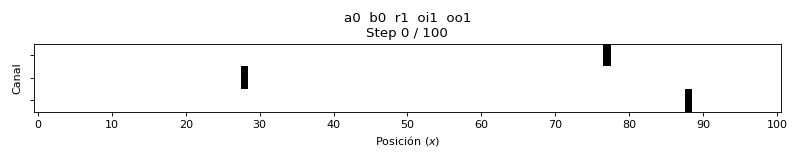
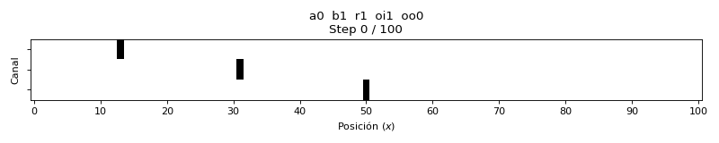
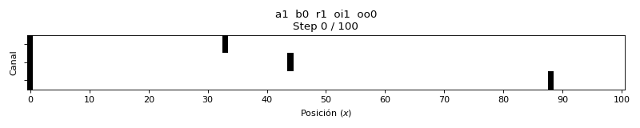
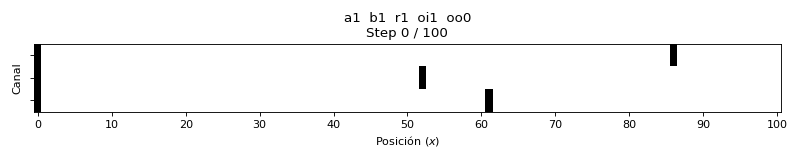

# SciCell++


[](https://codecov.io/gh/tachidok/scicellxx)
[](https://scicellxx.readthedocs.io)

---

SciCell++ is an object-oriented framework for the simulation of biological and physical phenomena modelled as continuous or discrete processes.

## Table of Contents

1. [Documentation](#documentation)
2. [Dependencies](#dependencies)
3. [Featured demos](#featured_demos)
4. [Execution Guide](#execution_guide)
5. [How to contribute](#how_to_contribute)
6. [Facts and curiosities](#facts_and_curiosities)
7. [License](#license)

## Documentation <a name="documentation"></a>

The full documentation is
[here](https://scicellxx.readthedocs.io/en/latest/?badge=latest). You
will find installation instructions, demos, tutorials and workflows to
ease your journey with SciCell++.

## Dependencies <a name="dependencies"></a>

For a detailed list of software requirements, refer to the [DEPENDENCIES.md](./DEPENDENCIES.md) file.

## Featured demos <a name="featured_demos"></a>

* Interpolation
* Linear solvers
* Matrices operations
* Newton's method
* Solution of ODE's
  * Lotka-Volterra solved with different time steppers
  * N-body problem (only 3-body and 4-body)
  * Explicit time steppers
  * Implicit time steppers (full implicit and _E(PC)^k E_
    implementations)
  * Adaptive time steppers

## Execution Guide <a name="execution_guide"></a>

This version includes optimized scripts to compile and run mTASEP simulations on both CPU (MPI) and GPU (CUDA).

### 1. CUDA Version (GPU)
To compile and run Rodolfo's GPU version:
```bash
# Grant execution permissions if necessary
chmod +x run_cuda.sh

# Run (it will automatically compile if the binary does not exist)
./run_cuda.sh

# Force recompilation and run
./run_cuda.sh --build
```

### 2. MPI Version (CPU)
To compile and run Julio's distributed version:
```bash
# Grant execution permissions
chmod +x run_mpi.sh

# Run
./run_mpi.sh
```

### mTASEP Model Parameters
The simulation uses the following parameters to define the microtubule dynamics:

| Parameter | Description |
| :--- | :--- |
| **L** | Length of the microtubule (number of sites). |
| **N** | Number of parallel channels (microtubules). |
| **Alpha ($\alpha$)** | Entry rate: Probability of a particle entering the first site of a channel. |
| **Beta ($\beta$)** | Exit rate: Probability of a particle leaving the last site of a channel. |
| **Rho ($\rho$)** | Hopping rate: Probability of a particle moving forward to the next site. |
| **Omega In ($\omega_{in}$)** | Attachment rate: Probability of a particle attaching to any empty site. |
| **Omega Out ($\omega_{out}$)** | Detachment rate: Probability of a particle detaching from any occupied site. |
| **Lateral Movement** | Enables (1) or disables (0) particles jumping between adjacent channels. |


### Hardware Tuning (CUDA)
To achieve maximum performance, you can tune the execution with:
- **`--cudathreads`**: Threads per block (multiples of 32 recommended, e.g., 256).
- **`--cudablocks`**: Calculated as `Total_Configs / cudathreads`. Using powers of 2 (e.g., 64) improves occupancy and scheduling.

> *Example: For 14,641 configurations (standard sweep), the optimal setting is `--cudablocks 64 --cudathreads 256`.*

### Quality Fixes for CUDA Version

#### Lateral Movement Bias Fix (Balanced Jump)
In the original model, when a particle attempted a lateral move, it would always check the adjacent channel "above" first and then "below". This created an artificial **upward drift**, where particles preferred lower-indexed channels.

The current version implements a **Balanced Jump** logic:
*   A random number is generated for each lateral move attempt.
*   **50/50 Chance**: There is a 50% probability of checking the "above" channel first and 50% for the "below" channel.
*   This ensures that the lateral movement is physically unbiased and the distribution of particles across channels remains uniform in equilibrium.

### CUDA Simulation Results (Animations)
Below are representative animations of the mTASEP dynamics for extreme configurations (where $r=1$, $oi=1$, etc.):

| Configuration | Animation |
| :--- | :--- |
| **$\alpha=0, \beta=0, \rho=1, \omega_{in}=1, \omega_{out}=1$** |  |
| **$\alpha=0, \beta=1, \rho=1, \omega_{in}=1, \omega_{out}=0$** |  |
| **$\alpha=1, \beta=0, \rho=1, \omega_{in}=1, \omega_{out}=0$** |  |
| **$\alpha=1, \beta=1, \rho=1, \omega_{in}=1, \omega_{out}=0$** |  |

> [!TIP]
> The scripts handle calling `autogen.sh` with the correct configuration files (`CUDA` or `mpi`) and manage the creation of output folders (`RESLT_CUDA` / `RESLT_MPI`).

### How to generate Animations (GIFs)
The project includes a Python script to convert the simulation snapshots into animated GIFs.

#### Step 1: Run the simulation with state output
To generate animations, you must enable the `output_microtubule_state` flag in the simulation (set to `1`) in the file `run_mpi.sh` or `run_cuda.sh`:

#### Step 2: Run the `csv_to_gif.py` script
Use the auxiliary script located in the `private/rodolfo/mTASEP/` directory:
```bash
cd private/rodolfo/mTASEP/
python3 csv_to_gif.py --results_dir output_folder --format cuda --delay 100 --cmap binary
```

*   `--results_dir`: Path to the folder containing the simulation results.
*   `--format`: Use `cuda` for the GPU version or `mpi` for the CPU version.
*   `--delay`: Time between frames in milliseconds (default: 100ms).
*   `--cmap`: Color map to use (default: binary).

The generated GIFs will be saved in the `output_folder/gifs/` folder.

## How to contribute <a name="how_to_contribute"></a>

Please check the
[constributions](https://scicellxx.readthedocs.io/en/latest/?badge=latest)
section in the documentation.

##### Optional

* MPI support for parallel features - `not currently supported`.

## Facts and curiosities <a name="facts_and_curiosities"></a>

### How many developers are currently working on this project?

At Thursday, December/23, 2021 there is one and only one developer, me
:no_mouth: :envelope:

:construction: :construction: :construction: :construction: :construction:

### When did this start?
This project was initially uploaded to GitHub on Friday, 11 March 2016
:smile:

## License <a name="license"></a>

Licensed under the GNU GPLv3. A copy can be found on the [LICENSE](./LICENSE) file.
